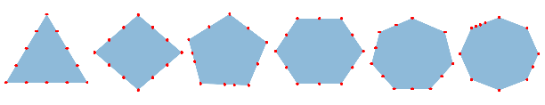
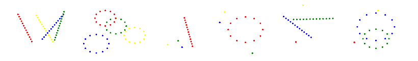
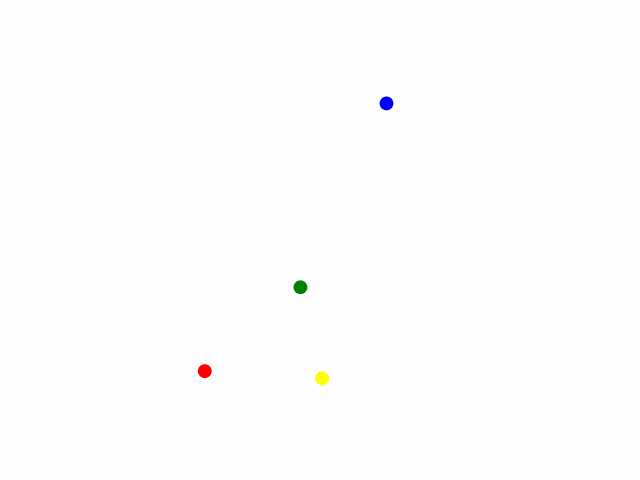
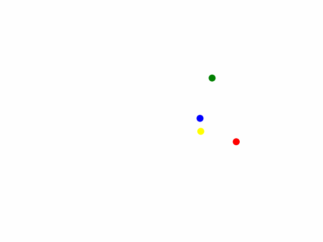
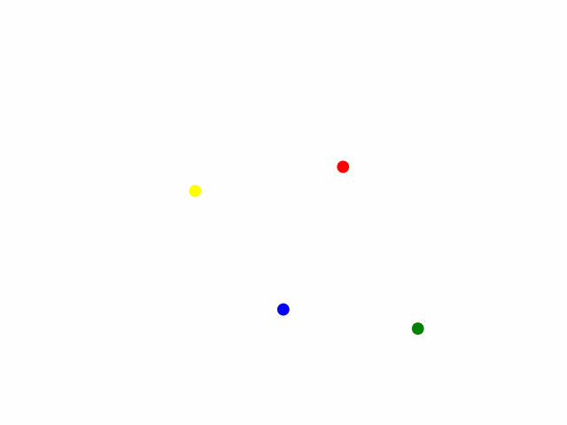
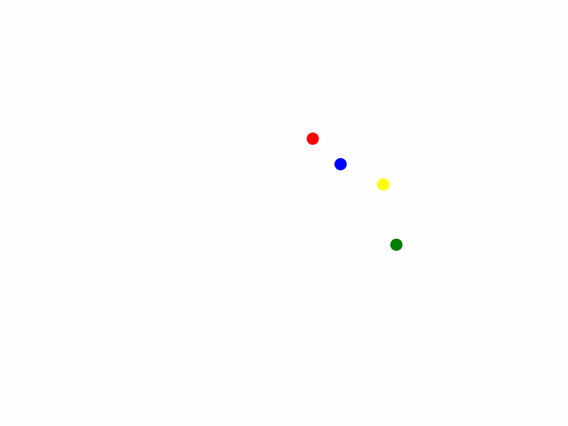
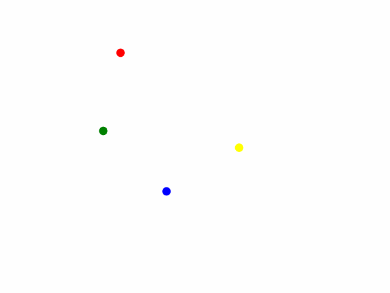
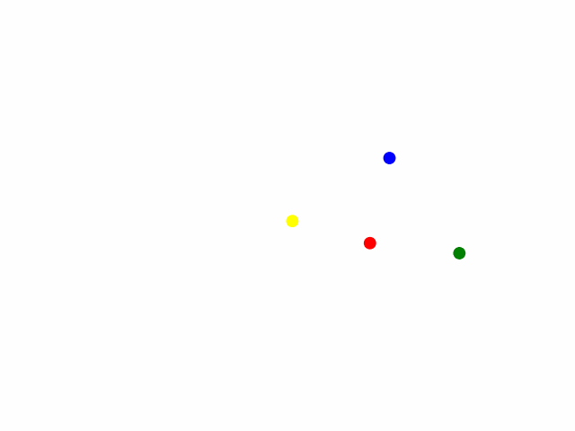

# Dots, Moving Dots
This repository contains two toy datsets - dots and moving dots, which can be used for mechanistic interpretability analyses and other applications. Both are classificatino datasets, where the input is a sequence of 2D coordinates.

## Description

### Dots data

In the Dots dataset, the classes are regular polygons (here, we used polygons from order 3 to 8). Each data point is created by generating a regular polygon with random orientation, scale, and position within the positive 1x1 space, followed by sampling N points from its perimeter, including the vertices. 
The code for generating data allows to generate as many data points with the specified number of sampling points. 
The orientation, scale, and position give variability while maintaining the characteristic structure, which is the shape.

### Moving dots data
In moving dots data, there are four ordered dots that are moving. Each dot can move in any one of the three ways - stationary, line, or circle. The pattern of movement for each dot defines a distinct class. The motion is sampled into N frames.
To introduce variability, the linear movement has a random orientation and direction, the circular movement has a random scale and direction (clockwise or anti-clockwise), and the stationary dot is placed at a random position.

The six classes which were used here are as follows (in order of dots):

- line, line, line, line
- circle, circle, circle, circle
- line, stationary, stationary, stationary
- circle, stationary, stationary, stationary
- stationary, line, line, stationary
- stationary, circle, circle, stationary

For example, a sample is classified as class 5 if the first and fourth dots are stationary while the second and third dots are moving linearly.

  

  

This dataset has a dynamic character. 
Each datapoint, initially with dimension (frame, dot, 2), is reshaped into (frame × dot, 2), forming a sequence of 2D coordinates, which is passed as input to the model (sequence length = 13 frames × 4 dots).
The positions in this sequence are meaningful; for instance, the first four positions correspond to the first frame, and so on.
That is, the inputs inherently carry semantic information by virtue of their positions in the sequence. 

## Usage

Use the `make_data.ipynb` notebook in the corresponding folder to generate data with a specified set of parameters. The data will be generated as four `.npy` files - `X_train`, `X_test`, `y_train`, `y_test`. A dataloader file which access these `.npy` files is also provided. 

In each, there is a ready to use dataset as well, which can be direclty used: 
- Dots : 10K datapoints per class, 12 samples in each datapoint, ordered.
- Moving dots : 10K datapoints per class, 13 frames.

Make changes in `dots.py`, `moving_dots.py` for tweaking the code; for example changing classes, adding classes, visualizing, etc. 